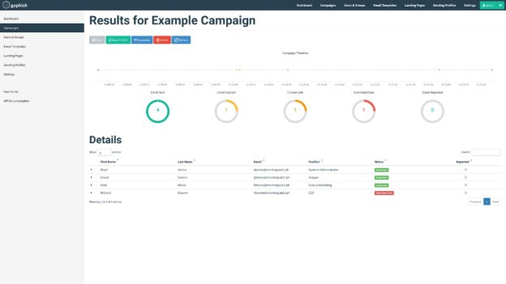

# Phishing Attack Simulation with Gophish

This repository provides a comprehensive guide to setting up and executing **phishing attack simulations** using **Gophish**, an open-source phishing framework. The objective is to **enhance cybersecurity awareness** and evaluate an organization's resilience against phishing attacks through controlled simulations.

## 🚀 Why Conduct Phishing Simulations?

Phishing remains one of the most prevalent **cybersecurity threats**, often leading to:

- **Credential theft**
- **Financial fraud**
- **Data breaches**

Despite advancements in **multi-factor authentication (MFA)** and **email filtering solutions**, the **human element** remains a critical vulnerability. Conducting phishing simulations helps organizations:

✅ **Educate employees** on phishing tactics and social engineering methods.
✅ **Assess security awareness** through real-world phishing scenarios.
✅ **Identify weaknesses** in existing cybersecurity defenses.
✅ **Strengthen incident response** by reinforcing best practices for recognizing and reporting suspicious emails.

## 🛠 About Gophish

**Gophish** is an open-source phishing simulation platform designed for security teams to **test and improve organizational security awareness**. It offers:

- A **user-friendly web interface** for managing phishing campaigns.
- **Customizable phishing email templates** with an HTML editor.
- **Automated email campaigns** with scheduled delivery options.
- **Real-time tracking and analytics** to measure campaign performance.

Gophish is written in **Go** and supports deployment on **Windows, macOS, Linux, and Docker environments**.

## 📌 Deployment Options

### Option 1: One-Click Deployment on Railway

[Railway](https://railway.app/) is a cloud-based application hosting platform that simplifies deployments.

### Steps to Deploy

1. **Sign up on Railway** using your GitHub account.
2. **Deploy Gophish** using the [one-click template](https://railway.app/).
3. **Monitor deployment logs** to retrieve admin credentials.
4. **Access the Gophish dashboard** via the generated Railway domain (`xxx.up.railway.app`).

### Option 2: Deploying Gophish via a Forked Repository

For a more **customizable** setup, deploy Gophish using a forked repository on Railway.

#### Steps to Deploy

1. **Fork the Gophish repository** on GitHub.

   

2. **Create a new Railway project** and deploy from the forked repository.
3. **Modify the `config.json` file** to include:
   - Setting `listen_url` to `0.0.0.0:3333` for external access.
   - Disabling `use_tls` (Railway manages TLS automatically).
   - Adding the **Railway domain** under `trusted_origins`.
4. **Commit changes** and redeploy the application.
5. **Access Gophish** via the Railway-assigned domain.

   

## 🎯 Running Phishing Simulations

1. **Log in** to the Gophish admin dashboard using the credentials from the deployment logs.

   

2. **Configure key components:**
   - **User Groups**: Define recipients for phishing emails.
   - **Email Templates**: Create realistic phishing messages.
   - **SMTP Settings**: Configure mail servers for email delivery.
   - **Landing Pages**: Design response pages for captured credentials.

3. **Launch a phishing campaign** via the Gophish dashboard.
4. **Monitor and analyze results** in real-time.

   

## 📊 Monitoring & Analytics

Gophish provides **detailed insights** into campaign performance, including:

- **Email open rates** and user engagement.
- **Click-through rates** for phishing links.
- **Credential submission tracking** to assess user awareness.

These insights help organizations refine their **cybersecurity awareness programs** and strengthen defenses against phishing attacks.

## 🔥 Conclusion

Gophish is a **cost-effective, scalable, and customizable** solution for conducting **phishing attack simulations**. While it may lack some of the advanced features of commercial phishing simulation platforms, it provides an excellent **open-source alternative** for organizations looking to improve their **cybersecurity awareness training programs**.

---

🔒 **Stay secure, stay aware!** 🔒

### 🌐 Keywords

- **Phishing Attack Simulation**
- **Gophish Phishing Framework**
- **Open-source Cybersecurity Tools**
- **Email Security Awareness Training**
- **Cybersecurity Best Practices**
- **How to Set Up Phishing Simulations**
- **Phishing Defense Strategies**
- **Social Engineering Prevention**
